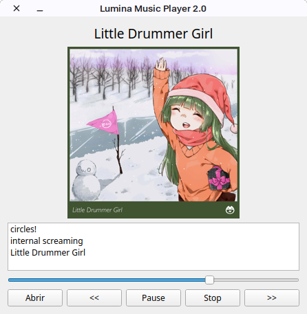

Lumina Music Player

Lumina Music Player (LMP) is a lightweight audio player built with PyQt6, focused on simplicity, clean design, and a user-friendly experience.

It is part of the Lumina project ecosystem and follows a minimal, distraction-free interface philosophy.

# Features

Audio-only playback

Playlist support

Automatic cover art detection:

Embedded ID3 (APIC) tags

cover.jpg, folder.jpg, front.jpg

Metadata title detection (fallback to filename)

Progress slider

Basic playback controls (Play / Pause / Stop / Next / Previous)

Clean Qt6 interface

